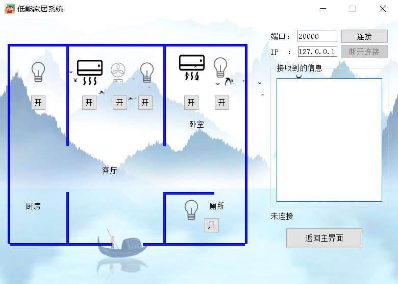
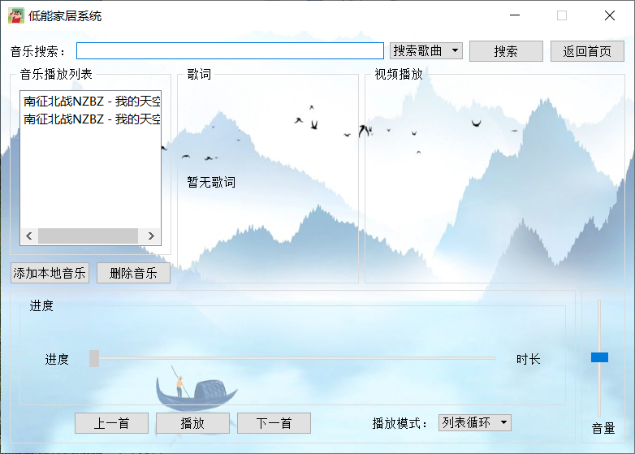
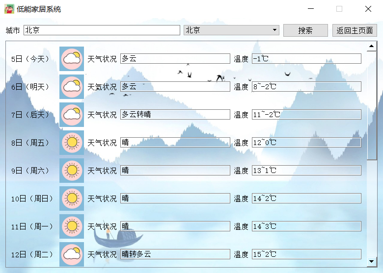
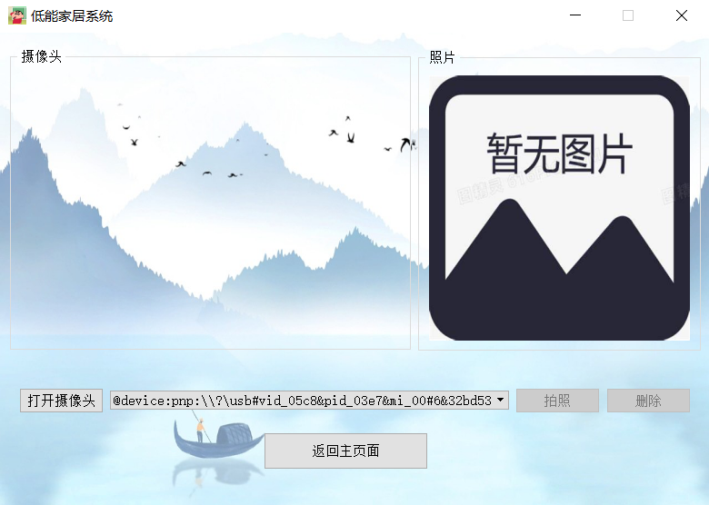

这个项目也是我学习qt的一个总结吧，还是有很多不足的地方的，后续我想到了一些完善的想法也会慢慢把功能给我完善一下的；

介绍一下我这个项目的功能。

有四个模块：智能家居、监控摄像头、音乐播放器、天气预报

智能家具有个服务器，在这个程序里面的是客户端系统，通过ip连接服务器之后，服务器上进行开关灯等操作，客户端可以进行信息同步。

监控摄像头可以检测当前设备可用的摄像头，可以打开摄像头进行拍照保存，默认保存在D：my_item_img中，（我要是没记错的话），没有文件夹的话，会自动建一个文件夹

音乐播放器，通过使用酷狗的api来进行音乐搜索的，因为是免费的api，所以付费歌曲没法听，但是可以播放mv（如果有的话），其实我还想做个歌词来着，但是暂时没时间了；歌词api找到了网易的，网易的api解析有点麻烦，就暂时没搞，要是搞了歌词我觉得这个音乐播放器就完美了。

天气预报也是用的免费api，可以搜索挺多地方的天气，右侧选择栏中有的地方都可以进行查询。

数据库用的是qt自带的sqlite数据库

智能家居功能截图

监控摄像头

音乐播放器

天气预报

